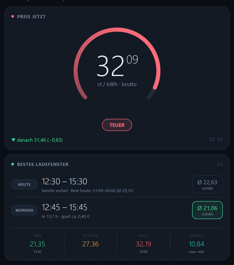
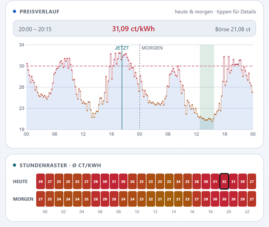
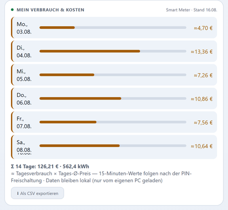
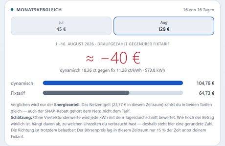
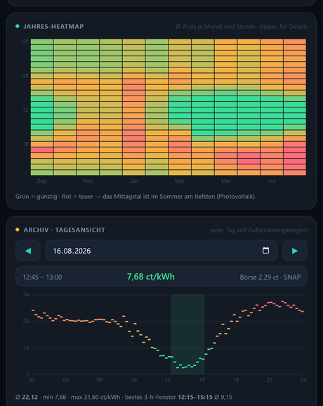
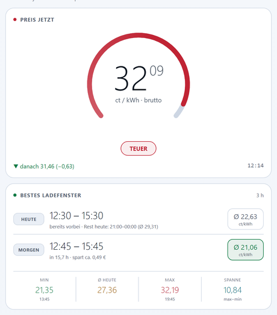
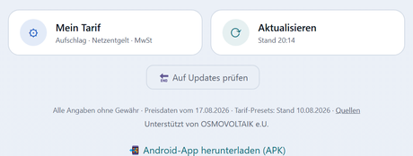

# ⚡ Grid Monitor — Dynamische Strompreise für Österreich

Strom-Cockpit für dynamische Tarife (VKW Strom dynamisch, aWATTAR, smartENERGY …) in
**15-Minuten-Auflösung** — als Web-App, Android-App und PC-Widget. Keine Anmeldung,
keine Datensammlung, kein fremder Server.

Die App beantwortet drei Fragen: **Was kostet Strom jetzt?** — **Wann heute ist es am
günstigsten?** — **Und was hat mich das am Monatsende wirklich gekostet?**

<div align="center">

[](https://github.com/Only1Rudeboy/gridmonitor/releases/latest/download/GridMonitor.apk)

**[→ Web-App direkt im Browser öffnen](https://only1rudeboy.github.io/gridmonitor/)**

</div>

| Preis & Ladefenster | Verlauf & Stundenraster |
|---|---|
|  |  |
| **Eigener Verbrauch** | **Monatsvergleich** |
|  |  |
| **Jahres-Heatmap & Archiv** | **Auch in Hell** |
|  |  |

## 📱 Nutzen

- **Web-App (auch iPhone):** https://only1rudeboy.github.io/gridmonitor/
  — im Browser öffnen und über „App installieren" bzw. „Zum Home-Bildschirm hinzufügen"
  wie eine App verwenden. Läuft dank Service Worker auch ohne Netz mit dem letzten Stand.
- **Android-App (APK):** [GridMonitor.apk herunterladen](https://github.com/Only1Rudeboy/gridmonitor/releases/latest/download/GridMonitor.apk)
  — Installation aus unbekannter Quelle bestätigen. Ab Android 8. Nur diese Variante kann
  benachrichtigen, ein Homescreen-Widget zeigen und sich selbst aktualisieren.
- **PC-Widget (Windows):** `vkw_grid_monitor_v3.py` — Vollbild-Dashboard, holt die
  Verbrauchsdaten aus dem Netzbetreiber-Portal und stellt sie im Heim-WLAN bereit.

## ✨ Funktionen

- **Preis jetzt** — Bruttopreis in ct/kWh mit Bewertungsring (günstig / normal / teuer)
- **Bestes Ladefenster** für heute und morgen, mit Ersparnis in Euro. Die HEUTE-Zeile
  zeigt immer das beste Fenster des **ganzen Tages** — ist es vorbei, steht das dabei
  samt bestem Rest-Fenster
- **Preisverlauf** heute & morgen — antippen zeigt jeden 15-Minuten-Slot
- **Stundenraster**, nächste Slots, **Preisbestandteile** (Börse · Aufschlag · MwSt · Netz)
- **Kosten-Rechner** — was kosten Waschgang, Geschirrspüler, Trockner, Laden jetzt
  gegenüber dem besten Fenster
- **Mein Verbrauch & Kosten** — echte Zählerdaten je Tag in Euro *(mit PC-Widget)*
- **Monatsvergleich gegen einen Fixtarif** — hat sich der dynamische Tarif gelohnt?
- **CSV-Export** der Verbrauchs- und Kostentabelle, passend für Excel
- **Jahres-Heatmap** (Monat × Stunde) und **Tagesarchiv** mit Datumswahl
- **Negativpreis-Anzeige ⚡** und **Preis-Alarm** unter einer frei wählbaren Schwelle
- **Benachrichtigung**, wenn das günstigste Ladefenster beginnt *(Android)*
- **Homescreen-Widget** mit aktuellem Preis *(Android)*
- **Selbst-Aktualisierung** — die App lädt neue Fassungen selbst und installiert sie
- **Hell und dunkel** — mit einem Tipp umschaltbar; beim ersten Start richtet sich die
  App nach der Geräteeinstellung
- **Dynamischer Tarif oder Fixpreis** — beides wählbar; auch beim Fixtarif zeigt die
  App die günstigeren Stunden (SNAP und Sommertarife)
- **Eigener Tarif** (⚙ Mein Tarif) mit Presets für ganz Österreich: 7 dynamische
  Tarife, 11 Fixtarife, alle 14 Netzgebiete
- **Warnung bei veralteten Daten**

## 💶 Wie der Preis gerechnet wird

```
brutto = (Börsenpreis + Aufschlag) × MwSt + Netzentgelt + Abgaben
```

Die Umsatzsteuer fällt auf **alles** an. In der Formel wird sie nur auf den Energieanteil
gerechnet, weil Netzentgelt und Abgaben bereits als **Bruttowerte** eingetragen werden —
so, wie sie in den Presets hinterlegt sind. Beispiel VKW Strom dynamisch in Vorarlberg,
Netzebene 7 („nicht gemessene Leistung", der Normalfall im Haushalt):

| Bestandteil | netto |
|---|---|
| Börsenpreis (EPEX Spot AT, viertelstündlich) | 14,060 ct |
| \+ Aufschlag laut Vertrag | 1,200 ct |
| \+ Netznutzungsentgelt Arbeitspreis | 4,960 ct |
| \+ Netzverlustentgelt | 0,393 ct |
| \+ Erneuerbaren-Förderbeitrag (0,583 + 0,037) | 0,620 ct |
| \+ Elektrizitätsabgabe (Haushalt, 2026 gesenkt) | 0,100 ct |
| **Summe netto** | **21,333 ct** |
| **\+ 20 % USt = Endpreis** | **25,60 ct/kWh** |

In der App entspricht das: Netzentgelt **6,42 ct** brutto (4,960 + 0,393, mal 1,2) und
Abgaben **0,86 ct** brutto.

**Achtung bei der Elektrizitätsabgabe:** Die Senkung auf 0,10 ct gilt 2026 nur für
**Haushalte am Hauptwohnsitz**. Für Betriebe und sonstige Lieferungen sind es
**0,82 ct/kWh** — dann liegen die Abgaben bei **1,73 ct** brutto. Im Tarif-Dialog wird das
über die Auswahl „Anschluss: Haushalt / Betrieb" gesetzt.

**Grundgebühren** hängen nicht am Verbrauch, stehen aber auf jeder Rechnung: Grundpreis des
Lieferanten, Netz-Grundpreis (54,00 €/Jahr netto, bundesweit einheitlich), Messentgelt
(rund 19–31 €/Jahr netto), Erneuerbaren-Förderpauschale (19,02 €/Jahr netto) und der
Leistungsanteil des Erneuerbaren-Förderbeitrags (3,80 €/Jahr netto). Trägt man die Summe
brutto im Feld „Grundgebühren" ein, verteilt die App sie gleichmäßig auf die Tage — damit
stimmt der Monatsbetrag mit der Rechnung überein.

*An einer echten VKW-Monatsrechnung gegengeprüft: Das Modell trifft den Rechnungsbetrag
auf 2 Cent genau (80,58 € gegen 80,60 €).*

**SNAP (Sommer-Nieder-Arbeitspreis):** Von 1. April bis 30. September gilt täglich von
10 bis 16 Uhr ein verringerter **Netz**-Arbeitspreis. Die Verordnung gibt dafür eigene
Werte vor (in Vorarlberg 3,97 statt 4,96 ct netto — das sind zwar genau 80 %, aber als
Tabellenwert, nicht als Rechenregel). Rabattiert wird nur das Netznutzungsentgelt, nicht
das Verlustentgelt. Der SNAP gilt **tarifunabhängig**, setzt aber viertelstündlich
gemessene und vom Netzbetreiber ausgelesene Werte voraus; Mengen in einer
Energiegemeinschaft sind ausgenommen. Die App rechnet ihn zeitgenau mit.

## 📌 Fixtarif oder dynamisch — beides geht

Unter „⚙ Mein Tarif" wählst du zwischen **Dynamisch** (Börsenpreis) und **Fixpreis**.

Auch mit einem Fixtarif lohnt sich die App: Der Endpreis ist nämlich **nicht** den ganzen
Tag gleich. Von April bis September ist das Netzentgelt zwischen 10 und 16 Uhr um 20 %
niedriger (SNAP) — und manche Anbieter senken in genau diesem Fenster zusätzlich den
Energiepreis. Beispiel VKW Strom Duo in Vorarlberg:

| Zeit | Energie | Netz | Abgaben | **Endpreis** |
|---|---|---|---|---|
| normal | 11,28 ct | 6,42 ct | 0,86 ct | **18,56 ct/kWh** |
| 10–16 Uhr, Apr–Sep | 10,08 ct | 5,14 ct | 0,86 ct | **16,08 ct/kWh** |

Das sind 2,48 ct Unterschied — die App zeigt das Fenster genauso an wie bei einem
dynamischen Tarif. Außerhalb der Sommermonate ist der Preis konstant; dann sagt die
App das auch ausdrücklich, statt ein Fenster zu erfinden.

Für 11 gängige Fixtarife sind Startwerte hinterlegt (VKW, Verbund, Salzburg AG,
Wien Energie, EVN, Energie AG, Energie Steiermark, Kelag, Burgenland Energie, Linz AG,
TIWAG). Energiepreise ändern sich häufig und hängen vom Vertrag ab — bitte mit der
eigenen Rechnung abgleichen, der Wert ist frei änderbar.

## 📊 Monatsvergleich — in beide Richtungen

Die App rechnet Monat für Monat aus, welches Tarifmodell günstiger war — egal, welches
du hast. Als Dynamik-Kunde siehst du, was ein Fixtarif gekostet hätte; als Fixtarif-Kunde,
was der Börsenpreis gekostet hätte.

**Verglichen wird ausschließlich der Energieanteil** — aus drei Gründen:

1. Das Netzentgelt ist in beiden Tarifen identisch (gleicher Netzbetreiber, gleiche kWh)
   und kürzt sich im Euro-Betrag exakt weg.
2. In einer Prozentangabe würde es sich **nicht** wegkürzen und den Tarifeffekt
   kleinrechnen.
3. **Der SNAP-Rabatt gehört dem Netz, nicht dem Tarif.** Er hängt daran, *wann* verbraucht
   wird, nicht daran, wer die Energie verkauft. Würde man ihn auf der dynamischen Seite
   mitzählen, schriebe man ihn fälschlich dem dynamischen Tarif gut.

| Größe | Rechnung |
|---|---|
| Dynamisch (Energie) | Σ kWh × (Börse + Aufschlag) × MwSt |
| Fixtarif (Energie) | Σ **dieselben** kWh × Fixpreis |
| Ersparnis | anderes Modell − eigenes, positiv = dein Tarif war günstiger |

**Genauigkeit:** Liegen nur Tageswerte vom Netzbetreiber vor, wird jede kWh mit dem
Tagesdurchschnitt bewertet — der Betrag ist dann eine Schätzung und wird als solche
gekennzeichnet (`≈`, auf ganze Euro gerundet). Zur Einordnung nennt die App zusätzlich,
in wie viel Prozent der Zeit der Börsenpreis überhaupt unter dem Fixtarif lag. Mit
freigeschalteten Viertelstundenwerten wird die Rechnung exakt.

## 🔌 Eigener Verbrauch (PC-Widget)

Das PC-Widget meldet sich beim Start und alle sechs Stunden am
[Vorarlberg-Netz-Webportal](https://webportal.vorarlbergnetz.at) an und holt die eigenen
Zählerstände. Zusammen mit der Preishistorie ergibt das die tatsächlichen Kosten je Tag.

- **Tageswerte** liefert das Portal von selbst — daraus entsteht eine Schätzung.
- **Viertelstundenwerte** müssen einmalig freigeschaltet werden (PIN-Brief des
  Netzbetreibers). Danach rechnet die App exakt, ohne dass etwas umgestellt werden muss.
- **Live-Werte** (sekundengenau) gibt das Portal nicht her — dafür braucht es einen
  Adapter an der Kundenschnittstelle des Zählers (M-Bus, „Slave"-Ausführung) oder ein
  Messgerät im Sicherungskasten.

Zugangsdaten stehen **ausschließlich** in der lokalen `config.json` neben dem Widget,
die Verbrauchsdaten in `verbrauch.json`. Beides verlässt den eigenen Rechner nicht.


**Tastatur:** `R` neu laden · `T` Thema · `S` Einstellungen · `H` Historie ·
`K` Stundenraster ↔ Kosten ↔ Monatsvergleich · `E` CSV-Export · `1`–`9` Fensterlänge ·
`F11` Vollbild · `Q` beenden

## 🔄 Selbst-Aktualisierung



Die Android-App fragt beim Start und über den Knopf **„Auf Updates prüfen"** bei GitHub
nach der neuesten Fassung. Gibt es eine, erscheint oben ein Hinweis mit dem Knopf
**„Aktualisieren"**: Die App lädt die neue Fassung selbst herunter, zeigt den Fortschritt
und startet die Installation. Beim ersten Mal fragt Android einmalig um Erlaubnis, dass
Grid Monitor Apps installieren darf.

Die Web-App braucht das nicht — sie ist beim Öffnen immer aktuell.

## 📋 Tarif-Presets

Im Tarif-Dialog sind die gängigen dynamischen Stromtarife Österreichs und die
Netzentgelte **aller 14 Netzgebiete** hinterlegt — Anbieter und Netzgebiet wählen, fertig.
Zentral gepflegt in [`docs/presets.json`](docs/presets.json) und ohne App-Update
aktualisierbar. Alle Angaben ohne Gewähr; bitte mit der eigenen Stromrechnung abgleichen.

## 📖 Quellen

- **Netzentgelte:** [SNE-V 2018 – Novelle 2026, BGBl. II Nr. 305/2025](https://www.ris.bka.gv.at/eli/bgbl/II/2025/305)
  — § 5 Abs. 1 Z 6 (Arbeitspreis und SNAP je Netzgebiet) und § 6 lit. b (Netzverlustentgelt).
  Alle 14 Netzgebiete am 17.08.2026 gegen den Verordnungstext und die Preisblätter der
  Netzbetreiber geprüft; letzte Änderung der Verordnung ist 305/2025.
- **Abgaben je kWh:** Erneuerbaren-Förderbeitragsverordnung 2026 (0,583 + 0,037 ct netto) ·
  [Elektrizitätsabgabe, für Haushalte 2026 auf 0,10 ct gesenkt](https://www.ris.bka.gv.at/eli/bgbl/I/2025/95)
- **SNAP-Rabatt (Netz, Apr–Sep 10–16 Uhr):** [BGBl. II Nr. 305/2025, § 5 Abs. 1b](https://www.ris.bka.gv.at/eli/bgbl/II/2025/305)
  · Bestätigung u. a. [Vorarlberg Netz](https://www.vorarlbergnetz.at/SNAP.htm), [IKB](https://www.ikb.at/energie/smart-meter/sommer-nieder-arbeitspreis)
- **Preisdaten:** [ENTSO-E Transparency](https://transparency.entsoe.eu) ·
  [aWATTAR](https://www.awattar.at/tariffs/hourly) ·
  [Energy-Charts](https://www.energy-charts.info) (CC BY 4.0)
- **Anbietervergleich dynamische Tarife:** [Smart Meter Portal (Stand 06/2026)](https://www.smartmeter-portal.at/dynamischer-stromtarif/anbieter-vergleich/)
- **Fixtarife zum Vergleich:** [VKW Strom Duo](https://www.vkw.at/produkte/strom/strom-duo) ·
  [E-Control Strompreismonitor](https://www.e-control.at/preismonitor)
- **Kundenschnittstelle des Zählers:** [Vorarlberg Netz, Info Day 2022 (PDF)](https://www.vorarlbergnetz.at/media/20221118_Info_Day_Kundenschnittstelle.pdf)

## 🔧 Technik

**Web-App** — reines HTML, CSS und JavaScript ohne Build-Schritt, eine einzige Datei.
Der Bruttopreis wird **immer clientseitig** aus dem eigenen Tarif gerechnet, damit
Tarifänderungen auch rückwirkend stimmen. Daten im `localStorage`, Service Worker für
den Offline-Betrieb, veröffentlicht über GitHub Pages aus diesem Repository.

**Android** — WebView-Hülle ohne Gradle gebaut (JDK 17, build-tools 34), minSdk 26.
Die Seite liegt als Asset in der App; ein JobScheduler-Dienst meldet Ladefenster und
Preisalarm, ein AppWidgetProvider zeichnet das Homescreen-Widget, eine JavaScript-Brücke
verbindet Seite und System (Tarif, Thema, CSV, Selbst-Aktualisierung).

**PC-Widget** — Python mit tkinter, eigener HTTP-Server für das Heim-WLAN, Preishistorie
als JSON je Monat. Gespeichert wird nur der **Roh-Börsenpreis**; brutto wird stets neu
gerechnet.

**Datenkette:** PC-Widget → Verteiler (dieses Repository) → aWATTAR → lokaler Cache.
Fällt eine Quelle aus, greift die nächste.

### Aufbau

```
gridmonitor/
├── docs/                  wird von GitHub Pages ausgeliefert
│   ├── index.html         die komplette Web-App
│   ├── prices.json        Roh-Börsenpreise, 3 Tage (Actions-Cron)
│   ├── history.json       Roh-Historie, 400 Tage rollierend
│   ├── presets.json       Anbieter- und Netzgebiets-Presets
│   ├── sw.js              Service Worker (Netz zuerst)
│   └── screenshots/       Bilder dieser Übersicht
└── scripts/
    └── fetch_prices.py    holt ENTSO-E und schreibt prices/history
```

Nicht in diesem Repository: das PC-Widget, die Android-Quellen und der Signaturschlüssel.
Der **ENTSO-E-Token** steht ausschließlich in der lokalen `config.json` und als
verschlüsseltes GitHub-Secret — niemals im Code.

---
*Privates Projekt, unterstützt von OSMOVOLTAIK e.U. · Alle Preisangaben ohne Gewähr —
maßgeblich ist die Abrechnung deines Lieferanten.*
